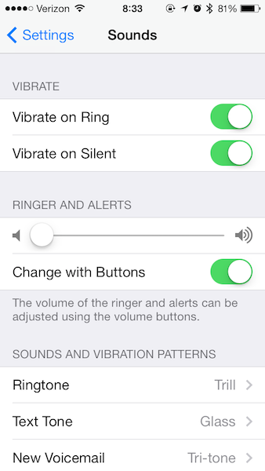

# Sounds Table

## Instructions

Your goal is to reproduce this settings page in a `UITableViewController`

The first step is to implement this just using static cells. Once you get that
working, try and make three different types of cells for the three different
types of cells here and use dynamic prototypes to make it work!

## Resources

  * [Using Storyboard with custom uitableviewcells](http://www.techotopia.com/index.php/Using_Xcode_Storyboards_to_Build_Dynamic_TableViews_with_Prototype_Table_View_Cells)
